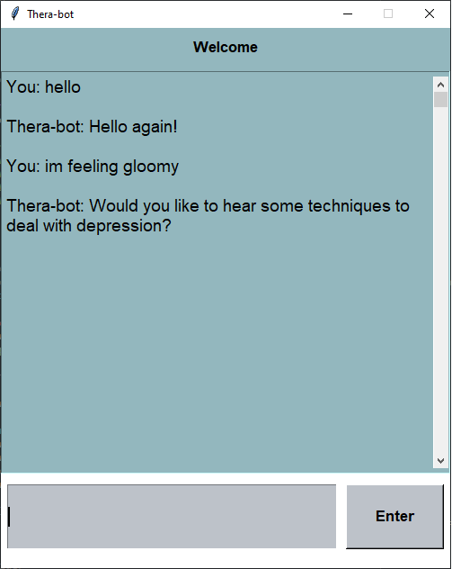

# Project Description
The goal of the project is to create an interactive conversational agent that assumes the role of a Psychiatrist.The Chatbot will essentially output *canned* responses to a users input. More specifically the bot will be trained to deal with users that are dealing with a variety of emotions such as depression, stress, loneliness. The user in this case will be a patients seeking help. 

## Chosen SDLC
The Software Development Lifecycle that we chose is the agile method. This model allows us to test and debug more due to the short iterations. It also allows us to identify problems and risks earlier and prevent them from happening in the future. Moreover, it provides us with flexibility to change things as we develop the chat bot, certain features or requirements.

## Limitations

•	The code is limited by the NLP algorithm which aims to understand what the user is writing and provide an answer from a json file with possible answers. Therefore, the bot is limited by the size and complexity of the provided responses. 

•	Since the bot is following a predetermined structure the same answer can be provided to the user repetitively. 

## Installation and Setup 

In order to run the chat bot the user must install the following libraries nltk, numpy, tflearn,random, json, pickle, tkinter, nltk. 

## Machine Learning
Machine Learning was used to train a model which can recognize certain patterns and words used in user input. This provides much more flexibility within the system when attempting to interpret these inputs. The bot is able to take the user input and estimate if what the user has said falls into one if its predefined categories that it knows how to respond to. For example, when given the input "I am Lonely" the bot will compare this statement with all its training data, searching for keywords and example statements in each response category with similar sentence structure. Once it has done this it will produce a percentage for each response category. This percentage represents the input statements similarity to the sentences in that category. Finally, it picks the category with the highest percentage similarity and depending on the category, it grabs a pre-written response to print to the user.

The model is traind with TensorFlow's Natural Language Toolkit.

## Synonym Recognition
Synonyms are used to improve upon the accuracy of the chatbot. By adding the synonyms one can answer the questions asked by the user that don’t really match the questions fed by you. This way, the bot can identify the intent and provide the right answer even when the question asked is not an exact match. For example if the user enters " I am feeling gloomy", the bot is not hardcoded to find the word gloomy and relate it to depression, but the synonym recognition script will find all the synonyms of gloomy and iterate through those synonimous phrases until it can understand something. In this case the phrase understood by the bot would be " I am feeling depressed".

The synonym recognition is done via the nltk + the WordNet toolkit. The script runs synonym recognition for each word in the string and generates a list of synonimous phrases.
Source: https://wordnet.princeton.edu/

## Graphical User Interface
The GUI is created from the python GUI toolkit called Tkinter. The interface is divided into 3 simple areas. First it the text widget, this is where the conversation is displayed. It is vertically scrollable allowing the user to see the conversation history. The second part is the message entry box. This is where the user enters their messages. Finally we have an enter button for the user to click to submit their message. The user can also simply press the enter key instead. The color pallete was designed to have a calming effext. The GUI makes calls to the main.py program to generated responses. It improves the overall system by providing ease of use and a relaxing aesthetic. 

Source: https://docs.python.org/3/library/tkinter.html

### Features in this Assignment
* Synonym Recognition (10 points) (see above for explanation)
* Machine Learning (10 points) (see above for explanation)
* Graphical User Interface (5 points) (see above for explanation)
